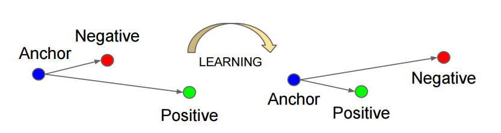

<figure>
    <p align="center">
    
    </p>
  <figcaption align = "center"></figcaption>
</figure>

# 📒 Description
<figure>
    <p align="center">
    
    </p>
  <figcaption align = "center"></figcaption>
</figure>

The **challenge problem** is to identify musical compositions that your network has never trained on.  You are given a set of musical compositions and names of the artists that composed them.  But you will be evaluated on musical compositions that were not availble during training.  Some of the evaluation music compositions will be from artists that you have trained on.  However, there will be some evaluation music compositions that are from **new artists**.  Your goal is to identify all of them as best as possible.


# 🛠️ Installation
In order to keep the repo small, all of the music files have been packaged as `midi` files.  These files are very small but cannot be played in audio format.  In order to convert the `midi` files to audio files you will need [**FluidSynth**](https://github.com/FluidSynth/fluidsynth/wiki/Download).

```console
brew install fluidsynth
poetry install
```

Keep in mind that FluidSynth requires a [**SoundFont**](https://github.com/FluidSynth/fluidsynth/wiki/SoundFont) in order for it to work.  SoundFont is a file format for sample-based instrument sounds. You will need a SoundFont to use FluidSynth.  SoundFonts are large files and do not come prepackaged with FluidSynth.  For this project you can download a SoundFont from  from [**S. Christian Collins**](https://www.dropbox.com/s/dl/4x27l49kxcwamp5/GeneralUser_GS_1.471.zip).  The file will have to be placed in the fluidsynth path.

```console
mkdir -p /~/.fluidsynth/
mkdir -p /usr/local/Cellar/fluid-synth/2.3.4/share/soundfonts/

cp <downloaded soundfont.sf2> /usr/local/Cellar/fluid-synth/2.3.4/share/soundfonts/default.sf2
cp <downloaded soundfont.sf2> ~/.fluidsynth/default_sound_font.sf2
```

**Note**: FluidSynth assumes that the SoundFont file in use is named `default.sf2`.  Make sure that when copying over the SoundFont, you name it appropriately.

After installation you will need to convert the `.mid` files to `.wav` files in order for training to happen.  This requires you execute:

```console
python src/preprocess.py
```

You can verify that the audio data works by listening to one of the `.wav` files generated from the process.

# 😎 Solution
I decided to build a representation embedding of the data which can be used to identify the musical composition.  The basis of this approach comes from the Google [FaceNet](https://duckduckgo.com/?q=google+facenet+paper&t=osx) paper.  The paper describes how to build a facial recognition system to identify people.  However, it can also be used to identify audio data if properly modified.

I first had to convert the `.mid` files into the `.wav` audio format in order to extract 30 seconds of audio data.  For this process I used [FluidSynth](https://github.com/FluidSynth/fluidsynth/wiki/Download) which is an open source library for converting MIDI files into audio formats.

Once I got the data converted into `.wav`, I examined how the data was represented as a tensor.  The tensor representation of audio data is very cumbersome because it is recorded at 44100 Hz.  This makes it very difficult to process because it was represented in the time vs amplitude domain.

I decided to transform the audio data from the time vs. amplitude domain into the time vs. frequency domain.  This is known as a spectrogram and it [common practice](https://learn.microsoft.com/en-us/training/modules/intro-audio-classification-pytorch/3-visualizations-transforms) among data scientists who work with audio data.  A graph of the conversion process is shown below.


<figure>
    <p align="center">
    
    </p>
  <figcaption align = "center"></figcaption>
</figure>

<figure>
    <p align="center">
    
    </p>
  <figcaption align = "center"></figcaption>
</figure>

The spectrogram that we created can be converted into a tensor which can be processed by a Convolutional Neural Network (CNN).  This allows us to treat the audio data more like image data which allows us to utilize our computer vision tools.  Additionally, this format is easier to work with than raw audio data because we don't have to represent the data at 44100 Hz.

However, some of the data is bad or corrupt.  When examining the audio files after conversion FluidSynth fails to process 2 of the MIDI files in the given dataset.  We need to add some data validation steps in the preprocessing to remove bad data from our pipeline.  Two of the files I identified as being bad or corrupt are:

    Violin Sonata No 7 in C minor_OP30NO2_2572_bevs7c
    Violin Sonata No 7 in C minor_OP30NO2_2573_bevs7d

The code is primary organized in the `src` folder.

```console
src
|-- data.py
|-- eval.py
|-- helper.py
|-- network.py
|-- preprocess.py
|-- train.py
```

The `data.py` file contains the code to generate training and validation datasets needed for our pipeline.  We split our 30-second clips of music between training and validation at 80% / 20%.  This allows us to train on part of the data and verify on the hold out set.  The dataset class is found here and will provide an iterator that outputs the training and validation samples.

`eval.py` contains the code for performing evaluation of the data.  There we generate the confusion matrix when benchmarking against the validation data.  The code for identifying which music tracks do not belong to any of our musicians can also be found there.

The `helper.py` file contains various helper functions that we need to perform plotting functions.

The `network.py` file contains our neural network architecture that we use to perform our training.  It contains a CNN that is designed to work with 2 channels for our audio data.  The network is fairly small and designed to work on CPUs instead of GPUs.

`preprocess.py` contains the code used to convert the `.mid` files into `.wav` files.  This is part of the preprocessing (i.e. data curation) that happens prior to any training or evaluation of the data.  We utilize the functions in this file to clean up and prepare the data prior to processing.

The `src.train.py` script performs the actual training of the data utilizing a PyTorch dataloader.  Here we use the Triplet loss on the spectrograms to update the neural network.  Once it is trained, we have a feature representation of the embedding space.  This embedding space can be used to recognize existing musical compositions or identify new compositions.  What is interesting about using a feature representation approach is that we are able to compare how musical compositions relate to each other.

The network architecture I used for this experiment is as follows:

```network
----------------------------------------------------------------
        Layer (type)               Output Shape         Param #
----------------------------------------------------------------
            Conv2d-1         [-1, 16, 60, 2580]             816
         MaxPool2d-2         [-1, 16, 30, 1290]               0
              ReLU-3         [-1, 16, 30, 1290]               0
            Conv2d-4         [-1, 32, 26, 1286]          12,832
         MaxPool2d-5          [-1, 32, 13, 643]               0
              ReLU-6          [-1, 32, 13, 643]               0
           Flatten-7               [-1, 267488]               0
            Linear-8                   [-1, 50]      13,374,450
              ReLU-9                   [-1, 50]               0
           Linear-10                   [-1, 25]           1,275
             ReLU-11                   [-1, 25]               0
----------------------------------------------------------------

* Total params: 13,389,373
* Trainable params: 13,389,373
* Non-trainable params: 0

----------------------------------------------------------------

* Input size (MB): 1.26
* Forward/backward pass size (MB): 42.63
* Params size (MB): 51.08
* Estimated Total Size (MB): 94.97

----------------------------------------------------------------
```
In order to test that my Triplet loss pipeline works I setup an example to quickly verify that the algorithm converges.  Using the example code, I am able to monitor that the loss goes from 1 to 0 given three different tensors that match the shape of my audio tensors.  This means that the pipeline works!

```python
# Configure the network
network = AudioNetwork()
network.train()

# Setup optimizer
optimizer = SGD(network.parameters(), lr=0.0001)

# Setup the loss function
triplet_loss = nn.TripletMarginLoss(margin=1.0, p=2)

waveform_anc = torch.ones(4, 2, 64, 2584, requires_grad=True)
waveform_pos = torch.zeros(4, 2, 64, 2584, requires_grad=True)
waveform_neg = torch.randn(4, 2, 64, 2584, requires_grad=True)

# Iterate over epochs
for epoch_idx in range(0, 10):

    # Perform training
    for sample in tqdm(dataloader_train, desc="Training", colour="green"):

        # waveform_anc = sample[0]
        # waveform_pos = sample[1]
        # waveform_neg = sample[2]

        optimizer.zero_grad()

        anchor__ = network(waveform_anc)
        positive = network(waveform_pos)
        negative = network(waveform_neg)

        # citation: https://pytorch.org/docs/stable/generated/torch.nn.TripletMarginLoss.html
        output = triplet_loss(anchor__, positive, negative)
        output.backward()

        optimizer.step()
```
The output is as follows:

```console
output loss=0.8479216694831848
output loss=0.2937873601913452
output loss=0.0
output loss=0.0
```

Here is a visual representation of how the Triplet loss separates clusters of data in the feature space during training.  We have 4 anchors which represent the four musicians.  When training finishes, the anchors will be positioned close to their positive (i.e. matching embeddings).

<figure>

<figcaption align = "center"><b>Fig: Triplet Loss Diagram</b></figcaption>
</figure>


When training this network on the actual music data I get a validation loss of approximately **0.39**.  Meaning that it was not able to completely separate the music into distinct categories in the feature space.  When we plot the confusion matrix across the categories we get:

<figure>

<figcaption align = "center"><b>Fig.1 - This is the confusion matrix on the training data.</b></figcaption>
</figure>

<figure>

<figcaption align = "center"><b>Fig.2 - This is the confusion matrix on the validation data.</b></figcaption>
</figure>

From this we can tell that our neural network is struggling on identifying Brahms' music.  We also see that Brahms' music gets classified as Bach a lot.  This was trained without a GPU, so the neural network architecture is not very sophisticated.  But in general, it looks like it is working.

There are several ways we could improve our performance against this dataset.  One way is through a neural network architecture search.  As noted before we are using a simple neural network architecture.  Another method is to use different loss functions which may help us with separating the classes out better.  We can also increase the training data used.  The current pipeline takes a 30-second clip from each music track.  However, we could have created multiple 30-second clips from each music track to increase our training data.

When using this neural network to identify which tracks from the test dataset could be from a different artist we can calculate the Euclidean distance of each sample versus the anchors we have built from our training set.  When we list out the minimum distance of the track versus our anchors we have the following:

```text
#              filename           min_dist
------------------------------------------
0    0.06402123326764841_adj.wav  1.232389
1     0.1960551158929671_adj.wav  1.298043
2    0.26551079719260606_adj.wav  1.357250
3    0.33695573887576447_adj.wav  1.520618
4      0.549470161204349_adj.wav  1.540388
5   0.033313986422223163_adj.wav  1.703796
6     0.3264565808984162_adj.wav  1.717431
7   0.047574444458241216_adj.wav  1.749667
8    0.10222964826466285_adj.wav  1.772565
9      0.539512676743813_adj.wav  1.774416
10     0.337517805339117_adj.wav  1.793020
11    0.8014751784512073_adj.wav  1.812814
12     0.647959423719129_adj.wav  1.840066
13     0.002716920481628_adj.wav  1.899282
14   0.22047111832936942_adj.wav  1.922808
15    0.7491289879531658_adj.wav  1.922891
16    0.9353908329958764_adj.wav  2.027948
17   0.10250888365879718_adj.wav  2.047207
18   0.21198476749665085_adj.wav  2.058754
19   0.10630249969742178_adj.wav  2.079702
20    0.9511403301279795_adj.wav  2.115459
21     0.981087291054314_adj.wav  2.156296
22    0.3620067189216978_adj.wav  2.170084
23    0.5807329043589801_adj.wav  2.179598
24   0.23120017256495873_adj.wav  2.211762
25    0.3334293069825759_adj.wav  2.251339
26   0.30993012400290976_adj.wav  2.255536
27   0.48367685897240176_adj.wav  2.384502
28   0.21901852969811753_adj.wav  2.410543
29     0.905499891236923_adj.wav  2.413190
30   0.09167358800381353_adj.wav  2.423666
31    0.3559970176888735_adj.wav  2.464270
32   0.36321860283443286_adj.wav  2.515043
33   0.07186746659481313_adj.wav  2.529241
34    0.1755252422917658_adj.wav  2.816682
```
The filenames with the highest minimum distances to our anchors are the ones more likely to be different from the music tracks I trained on.  This method does not definitively identify which music tracks are not from our list of artists, but it gives a metric we can use to gauge the similarity to our existing music tracks.

# 🔧 Troubleshooting

## Missing SoundFonts
FluidSynth does not come with a SoundFonts by default.  But it needs one in order for it to work.  See discussion [**here**](https://github.com/FluidSynth/fluidsynth/issues/1005).


## Panic Messages
FluidSynth outputs a panic message when performing its conversion process.

```console
fluidsynth: panic: An error occurred while reading from stdin.
```

However, the audio files seem to convert properly without issues.  This error message can be safely ignored.

## Corrupted Files
Note that you will not able to convert 2 files from `.mid` to `.wav`:

    Violin Sonata No 7 in C minor_OP30NO2_2572_bevs7c
    Violin Sonata No 7 in C minor_OP30NO2_2573_bevs7d

It is possible that these files are corrupt or there is some other issue with FluidSynth's conversion process.
